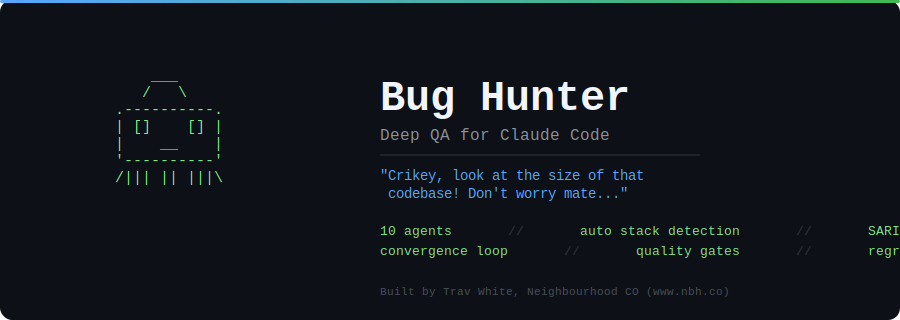
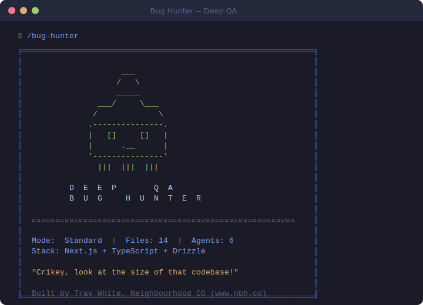
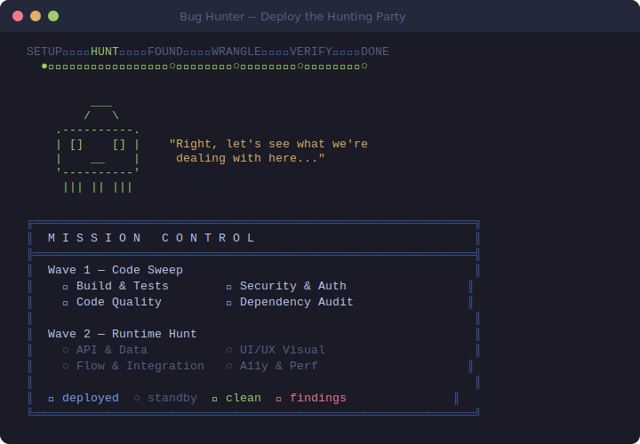
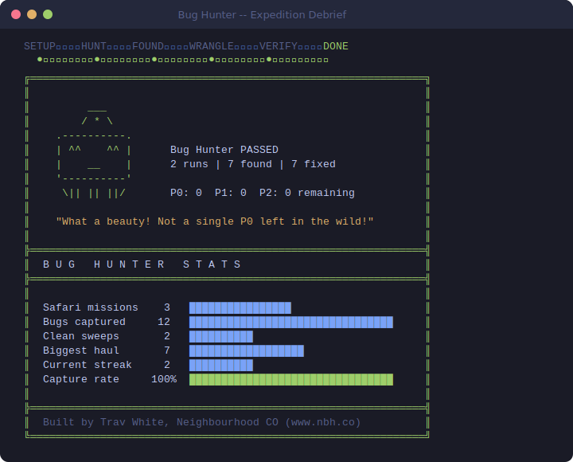
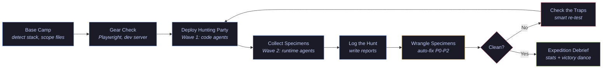

<p align="center">
  
</p>

<p align="center">
  
  
  
  
</p>

<p align="center">
  <i>"Crikey, look at the size of that codebase! Don't worry mate, we've got 10 specially trained agents ready to wrangle every last bug out of hiding."</i>
</p>

---

Bug Hunter is an iterative, multi-layer quality assurance skill for [Claude Code](https://claude.ai/claude-code). It tracks down every bug, broken flow, missing state, and visual issue lurking in your code -- then wrangles them -- then verifies they stay caught -- looping until the habitat is clean or the gnarly ones get escalated to a human.

Auto-detects your tech stack. Scales its agent swarm to match the size of your changes. Narrates the whole safari with ASCII dashboards, threat meters, and a trophy case of everything you've caught.

## What You'll See

Every session kicks off with the splash screen, then the Bug Hunter narrates every stage with dashboards, progress trackers, and Steve Irwin-style commentary.

<p align="center">
  
</p>

Agents deploy in waves. Mission Control shows you who's out in the field and who's standing by.

<p align="center">
  
</p>

When the habitat is clean, you get the victory display with career stats, capture rate, and streak tracking.

<p align="center">
  
</p>

See [`references/bug-hunter.md`](references/bug-hunter.md) for the full visual system specification -- 10 character states, 8 composite displays, quote pools, and every dashboard component.

## Features

No bug too small, no code path too wild.

- **10 specialist agents** -- each one trained for a different species of bug: build failures, security holes, design drift, code smells, API mishaps, UI jank, broken flows, accessibility gaps, dodgy dependencies, and migration landmines
- **Auto-scaling swarm** -- 1-5 files? Sends a single scout. 20+ files? Deploys the full hunting party
- **Stack-adaptive** -- sniffs out Next.js, Laravel, Python, Rust, Go, static sites, and more
- **Convergence loop** -- hunts, wrangles, re-tests, repeat. Doesn't let up until the habitat is clean
- **Bug Hunter visual system** -- ASCII dashboards, Safari Trail, Threat Level Meter, Bug Trophy Case, Wrangling Progress, Stats Dashboard, and a mascot with 10 moods
- **Regression detection** -- catches bugs that play dead. If a fix unravels, it gets auto-escalated to P0
- **Multiple output formats** -- Markdown, SARIF, JSON, GitHub annotations, terminal
- **Quality gate** -- binary PASS/FAIL for CI pipelines. Simple as
- **Safari log** -- tracks quality trends across sessions
- **Protected species** -- some bugs are features. Suppress with expiry dates
- **Test stub generation** -- spots untested code paths and generates skeletons
- **Project config** -- severity overrides, custom rules, excluded paths, custom agents

## Installation

Drop it in and you're ready to hunt:

```bash
# Global install -- available across all projects
cp -r bug-hunter ~/.claude/commands/

# Project-specific install -- just this repo
cp -r bug-hunter <your-project>/.claude/commands/
```

## Usage

```bash
/bug-hunter                          # Full safari -- hunt everything
/bug-hunter:setup                    # First-time base camp setup
/bug-hunter --scope=security         # Target specific species
/bug-hunter --area=src/finance       # Hunt an entire territory
/bug-hunter --diff-only              # Only uncommitted changes
/bug-hunter --fix=false              # Recon only -- report, don't wrangle
/bug-hunter --gate --format=sarif    # CI quality gate mode
/bug-hunter --generate-tests         # Generate test stubs
/bug-hunter --continue               # Resume a previous expedition
/bug-hunter --report                 # Check safari status
```

## How the Safari Works



1. **Base Camp** -- Reads the lay of the land. Loads CLAUDE.md, detects tech stack, scopes the hunting ground. *"Right, let's see what we're dealing with here..."*
2. **Gear Check** -- Checks Playwright, dev server, SSH. Can't catch runtime bugs without a running app
3. **Deploy the Hunting Party** -- Launches code analysis agents in parallel. Shows Mission Control board
4. **Collect Specimens** -- Runtime agents go next. Shows Threat Level Meter and Bug Trophy Case
5. **Log the Hunt** -- Documents every specimen. Markdown, SARIF, JSON, GitHub annotations
6. **Wrangle Specimens** -- Auto-fixes P0-P2 with per-bug progress tracking. *"Easy does it..."*
7. **Check the Traps** -- Smart re-testing. Only re-deploys agents whose territory was touched
8. **Expedition Debrief** -- Stats Dashboard, capture rate, streak tracking. *"What a beauty!"*

## The Agent Squad

| # | Agent | Speciality | When deployed |
|---|-------|-----------|---------------|
| 1 | **Build & Tests** | Build failures, test regressions | Always -- the gatekeeper |
| 2 | **Security & Auth** | Injection, auth bypass, leaked secrets | Always |
| 3 | **Design System** | Component drift, token violations | When design rules exist |
| 4 | **Code Quality** | Smells, dead code, type issues | Always |
| 5 | **API & Data** | Endpoint bugs, data integrity | When API routes in scope |
| 6 | **UI/UX Visual** | Visual regressions, layout bugs | When Playwright available |
| 7 | **Flow & Integration** | Broken user journeys | When Playwright available |
| 8 | **A11y & Performance** | WCAG violations, perf issues | When UI in scope |
| 9 | **Dependency Audit** | CVEs, outdated packages | When package manager detected |
| 10 | **Migration Safety** | Schema conflicts, data loss | When ORM + migrations in scope |

## Threat Classification

Not all specimens are created equal.

| Level | What it means | Auto-wrangle? |
|-------|--------------|--------------|
| **P0** | The habitat is on fire. Build breaks, security holes, data loss | Yes -- drop everything |
| **P1** | That's gonna leave a mark. Runtime errors, auth failures | Yes |
| **P2** | Bit rough around the edges. Code smells, missing states | Yes |
| **P3** | She'll be right. Convention drift, style nits | No -- report only |

<details>
<summary><strong>Directory Structure</strong></summary>

```
bug-hunter/
├── SKILL.md                      # The safari playbook
├── agents/                       # Agent field manuals
│   ├── lite.md                   # Solo scout (small diffs)
│   ├── build.md                  # Agent 1: Build & Tests
│   ├── security.md               # Agent 2: Security & Auth
│   ├── design.md                 # Agent 3: Design System
│   ├── quality.md                # Agent 4: Code Quality
│   ├── api.md                    # Agent 5: API & Data
│   ├── ui.md                     # Agent 6: UI/UX Visual
│   ├── flow.md                   # Agent 7: Flow & Integration
│   ├── a11y.md                   # Agent 8: A11y & Performance
│   ├── dependency.md             # Agent 9: Dependency Audit
│   └── migration.md              # Agent 10: Migration Safety
├── references/                   # Field guides
│   ├── bug-hunter.md             # Visual system spec (the good stuff)
│   ├── stack-profiles.md         # Tech stack detection matrix
│   ├── severity-guide.md         # Threat classification guide
│   └── critical-rules.md        # Rules of the hunt
├── assets/                       # Report templates + images
│   ├── images/                   # README visual assets
│   ├── session-template.md       # Mission briefing template
│   ├── run-report-template.md    # Hunt log template
│   ├── summary-template.md       # Expedition report template
│   ├── config-template.md        # Project config template
│   ├── history-template.md       # Safari log template
│   └── suppressed-template.md    # Protected species template
└── workflows/
    └── setup.md                  # Base camp setup wizard
```

</details>

<details>
<summary><strong>Project Configuration</strong></summary>

Every habitat is different. Run `/bug-hunter:setup` for the guided wizard, or hand-craft `.planning/qa/config.md`:

```markdown
## Severity Overrides
| Category | Minimum Severity | Reason |
|----------|-----------------|--------|
| security | P0 | All security findings are blockers |
| a11y | P1 | WCAG AA required |

## Excluded Paths
| Pattern | Reason |
|---------|--------|
| src/legacy/** | Scheduled for controlled burn |

## Custom Rules
### security
- All API routes must check x-api-key header

## Custom Agents
### Agent: data-freshness
**Wave**: 1
**Scope**: src/cron/**
**Prompt**: |
  Check all cron sync jobs for staleness checks...
```

</details>

## Requirements

- [Claude Code](https://claude.ai/claude-code) CLI
- A git repository (the Bug Hunter needs tracks to follow)
- Stack-specific tooling: Node.js/npm/pnpm, PHP/Composer, Python/pip, etc.
- Optional: Playwright (for the full runtime hunt), dev server running

---

<p align="center">
  <sub>Built by Trav White, <a href="https://www.nbh.co">Neighbourhood CO</a></sub>
</p>

<p align="center">
  <sub>MIT License</sub>
</p>
